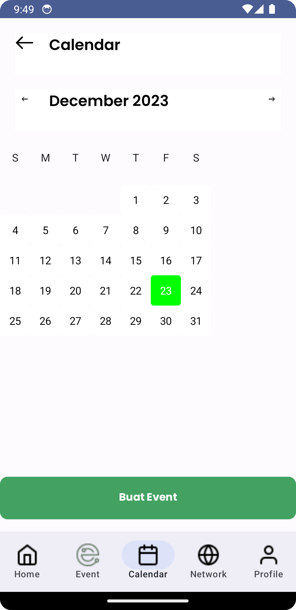
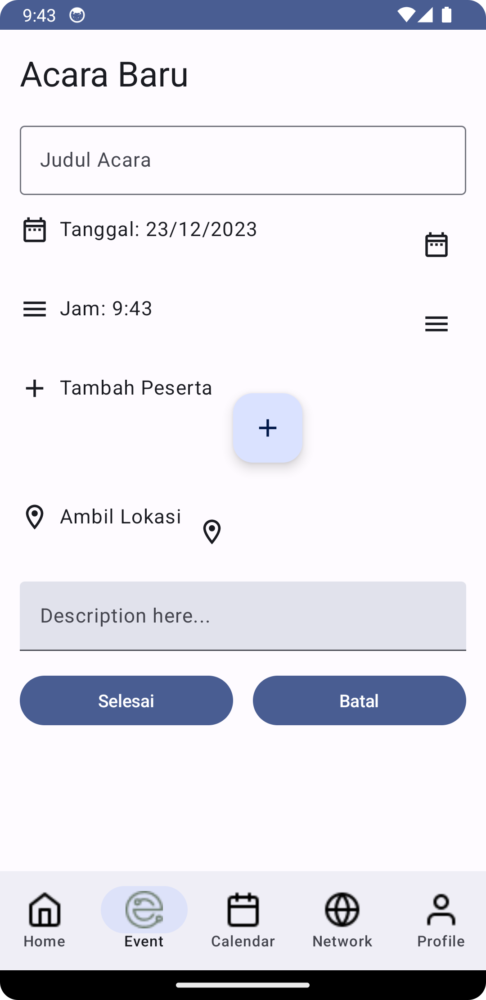

# Alumni Connect Apps Menggunakan Jetpack Compose

Alumni Connect adalah sebuah aplikasi yang dibangun sebagai wadah yang mempermudah para alumni Fakultas Ilmu Komputer dan Teknologi Informasi menjalin komunikasi untuk memperkuat ikatan persaudaraan antar sesama alumni dan fakultas, yang memuat berbagai aktivitas di Fakultas, serta menjadi aplikasi yang menyediakan ruang diskusi yang bertujuan untuk mendukung perkembangan Fakultas.

## Fitur

  - Login
  - Registrasi Akun
  - Profil
  - Kalender
  - Event
  - My Network
## Screenshots

  -	Home Screen: Pada halaman ini memuat daftar aktivitas seperti pencapaian mahasiswa/dosen, perlombaan, dan berbagai informasi lainnya seputar kegiatan yang dilaksanakan  mahasiswa maupun dosen di Fasilkom-TI.

  -	Read More: Ini merupakan halaman yang menampilkan informasi secara detail mengenai aktivitas-aktivitas yang ada diinformasikan di Home Screen.

  -	Calendar: Disini memuat kalender serta sebagai halaman untuk  menambahkan event yang nantinya akan diarahkan ke halaman Event untuk menambahkannya.

  -	Event: halaman ini sebagai temat menambahkan acara yang akan diselenggarakan fakultas dengan membuat tema acara beserta deskripsi dan lampiran, membuat jadwal, undangan untuk peserta, juga menambahkan link Google Meet sebagai tempat melaksanakan acara secara online maupun menambahakan lokasi acara untuk acara offline.

  -	My Network: Di halaman ini kita bisa mencari daftar alumni Fasilkom-TI serta informasi dari alumni yang sudah melakukan registari dan sudah terdaftar di Data Base.

  -	User Profile: Di halaman ini, pengguna bisa mengakses help desk, informasi tentang aplikasi, pengaturan, serta dapat mengedit informasi pengguna.


## API Key
Alumni Connect API adalah API RESTful stateless yang diprogram untuk membuat, meng-edit, menyimpan, dan menghapus user (alumni), berita, dan penjadwalan. API ini dibangun menggunakan NodeJS dan menyimpan data menggunakan database FireStore.
API ini memerlukan dua aplikasi untuk dapat berjalan:
- NodeJS ([Download](https://nodejs.org/en/download/))
- FireStore ([FireBase](https://firebase.google.com/))

API ini dapat diakses melalui link dibawah ini:
```
https://alumni-usu-server.vercel.app/api/v1/cms
```
Dokumentasi API lengkapnya dapat dilihat [disini](https://documenter.getpostman.com/view/26317261/2s9YkoehKz#overview) 

